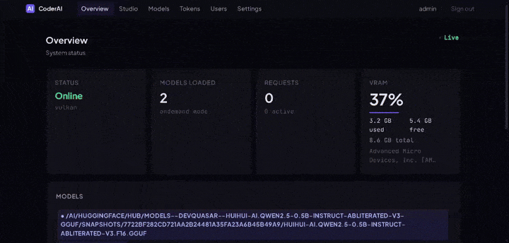

# CoderAI

**Repository:** [https://git.nexlab.net/nexlab/coderai](https://git.nexlab.net/nexlab/coderai)



An OpenAI-compatible API server to run models on your local GPU with web administration dashboard, supporting multiple GPU backends: NVIDIA (CUDA), AMD (Vulkan), and Intel (Vulkan). Configuration-driven architecture with per-model settings and full multi-modal support.

## Features

### Core Capabilities
- **OpenAI-Compatible API**: Drop-in replacement for OpenAI's API endpoints
- **Web Studio**: Modern UI for all generation tasks — chat, image, video, audio, pipelines
- **Configuration-Based**: JSON config files for all settings — no complex CLI arguments
- **Multi-Modal**: Text, image, video, audio, TTS, STT, embeddings
- **Per-Model Configuration**: Individual settings for each model (GPU layers, quantization, context size)
- **On-Demand Loading**: Models load automatically when requested, unload when idle
- **Memory Management**: Smart VRAM → RAM → Disk offloading for efficient resource usage
- **Parallel Execution**: Run multiple models simultaneously (VRAM permitting)
- **Auto-Swap**: Automatic model switching on request — load what's needed, unload what's idle
- **Request Queue**: Concurrent requests are queued and processed in order per model
- **Prompt Caching**: Reuse KV cache across requests to reduce latency and computation
- **Prompt Aggregation**: Batch concurrent requests into a single inference pass for higher throughput
- **Custom Pipelines**: Create and save multi-step workflows combining any generation tasks
- **Pre-Built Pipelines**: Ready-to-use pipelines for common workflows (image-to-video, dubbing, story generation)

### GPU Backend Support
- **NVIDIA (CUDA)**: PyTorch + Transformers for HuggingFace models
- **AMD GPUs**: llama-cpp-python + Vulkan for GGUF models
- **Intel GPUs**: iGPU/Arc support via Vulkan
- **Auto-Detection**: Automatically selects best available backend
- **Multi-GPU**: Automatic distribution across multiple devices

### Image Generation
- **Text-to-Image**: Stable Diffusion, SDXL, Flux, and GGUF image models (via stable-diffusion.cpp)
- **Image-to-Image**: Style transfer and image editing
- **Inpainting**: Fill masked regions with AI-generated content
- **Upscaling**: Real-ESRGAN super-resolution (2×/4×/8×)
- **Deblur**: Wiener deconvolution + unsharp masking
- **Unpixelate**: Real-ESRGAN restoration of pixelated/compressed images
- **Outfit Change**: Auto-generated clothing mask + inpainting for wardrobe changes
- **Face Swap**: InsightFace INSwapper — swap faces in images and videos
- **Depth Estimation**: Monocular depth maps
- **Segmentation**: SAM-based object segmentation
- **Character Profiles**: Apply up to 6 named character profiles (IP-Adapter) to anchor appearance across generations
- **Environment Profiles**: Apply up to 6 named environment profiles to condition scene/background style
- **Generation Progress**: Real-time per-step progress tracking via `GET /v1/images/progress`

### Video Generation
- **Text-to-Video**: Generate video from text prompts
- **Image-to-Video**: Animate a still image
- **Video-to-Video**: Transform existing video
- **Ti2V**: Text + image → video with camera motion control
- **Frame Interpolation**: Increase FPS via RIFE or ffmpeg minterpolate
- **Upscaling**: Real-ESRGAN video upscaling
- **Subtitles**: Whisper transcription + optional translation + burn-in
- **Dubbing**: Transcribe → translate → TTS → replace audio track
- **Character Profiles**: Apply up to 6 saved character profiles for visual consistency
- **Environment Profiles**: Apply up to 6 saved environment profiles to condition the scene
- **Multi-Character Dialog**: Assign spoken lines to individual characters — each line picks a character profile, voice profile or TTS voice ID, and text; lines are TTS-synthesised, mixed with correct timing (sequential or manual), and lip-synced to the video via Wav2Lip or SadTalker

### Audio
- **Text-to-Speech**: Kokoro TTS with voice selection and speed control
- **Speech-to-Text**: Whisper transcription (faster-whisper / whispercpp)
- **Music/SFX Generation**: MusicGen, AudioGen, AudioLDM2
- **Voice Cloning**: F5-TTS zero-shot voice cloning from a reference audio clip
- **Voice Conversion (SVC)**: Seed-VC — converts timbre while preserving pitch, melody and expression; **singing mode** for music
- **Voice Profiles**: Save named voice profiles (reference audio + transcript) for reuse; voice profiles can now be extracted directly from video files and updated via PATCH

### Character Profiles
Named collections of reference images used to condition character appearance via IP-Adapter across any image or video generation. Up to 6 profiles can be selected per generation.

- **Extract from images/video**: Automatic face detection and cropping to build a reference set
- **Generate from text prompt**: Create reference images from a visual description (no source images needed) using any registered image model
- **Reuse across generations**: Select saved profiles by name in the API or web UI
- **CRUD API**: Create, list, view, patch (add/remove images), and delete profiles

### Environment Profiles
Named collections of reference images that condition scene background and environment style via IP-Adapter. Same multi-slot selection (up to 6) as character profiles.

- **Extract from images/video**: Selects the sharpest frames/images (no face crop — full image used)
- **Generate from text prompt**: Create reference images from a scene description using any registered image model
- **Reuse across generations**: Select saved profiles by name in image and video generation

### 2D ↔ 3D Conversion
- **Image → 3D**: Convert any image to stereo pair, anaglyph, depth map, or mesh (GLB/OBJ) via depth estimation + optional 3D reconstruction
- **3D → Image**: Render a GLB/OBJ model to a 2D image from a specified viewpoint
- **Video → 3D**: Apply frame-by-frame depth processing to produce a 3D video
- **3D → Video**: Render a 3D model as a turntable rotation video
- **Text/Image → 3D Model**: Generate a 3D GLB model from a text prompt or reference image (requires a compatible 3D generation model)

### Generation Archive
- **Auto-save**: Every generated file (image, video, audio) is optionally saved to a configurable local directory
- **Configurable retention**: `1h`, `1d`, `2d`, `1w`, `1m`, `3m`, `6m`, `1y`, or `never` — automatic hourly cleanup
- **Browse & delete**: View and delete archived files from the web UI Archive tab or via the API
- **Settings page**: Archive directory and retention are configurable from the web UI Settings page without a restart

### Pipelines
Built-in multi-step pipelines callable from the API or web UI:

| Endpoint | Description |
|---|---|
| `POST /v1/pipelines/image-to-video` | Generate image → animate → optional audio |
| `POST /v1/pipelines/video-dub` | Transcribe → translate → TTS dub → burn subtitles |
| `POST /v1/pipelines/story` | LLM script → images per scene → video → TTS narration |
| `POST /v1/pipelines/audio-dub` | Transcribe audio/video → translate → clone voice → replace audio |

**Custom Pipeline Builder**: Create, save and run your own multi-step pipelines from the web UI or API. Chain any combination of 18 step types with `{{input}}` and `{{stepN.output}}` template variables.

### Advanced Features
- **Memory Management**: Smart VRAM → RAM → Disk offloading (NVIDIA)
- **Quantization**: 4-bit/8-bit via bitsandbytes (NVIDIA) or GGUF quantization (Vulkan)
- **Flash Attention 2**: Optional faster inference for supported NVIDIA GPUs
- **Streaming**: Server-sent events for real-time token generation
- **Tool Calling**: Function calling and tool use support
- **Authentication**: Session-based auth with API token support
- **Webcam/Microphone**: Capture directly from browser for face swap and voice cloning

---

## Quick Start

```bash
git clone git@git.nexlab.net:nexlab/coderai.git
cd coderai
./build.sh all          # build all backends (recommended)
source venv_all/bin/activate
python coderai          # starts on http://127.0.0.1:8776
```

macOS:

```bash
./osxbuild.sh all
source venv_osx_all/bin/activate
python coderai
```

Windows PowerShell:

```powershell
.\build.ps1 -Backend all
.\venv_win_all\Scripts\Activate.ps1
python coderai
```

That's it. Open `http://127.0.0.1:8776/admin` and log in with `admin` / `admin`.

---

## Installation

### Prerequisites

- Python 3.8+
- For NVIDIA GPUs: CUDA toolkit (11.8+ recommended)
- For AMD/Intel GPUs (Vulkan): Vulkan drivers and SDK
- For CPU-only: No additional requirements

### Build Script

```bash
git clone git@git.nexlab.net:nexlab/coderai.git
cd coderai

./build.sh all      # All backends (recommended)
./build.sh nvidia   # NVIDIA only
./build.sh vulkan   # AMD/Intel only
```

Platform-specific alternatives:

```bash
./osxbuild.sh all   # macOS, prefers Metal-backed builds when available
```

```powershell
.\build.ps1 -Backend all   # Windows, prefers CUDA-backed builds when available
```

Packaging options:

```bash
./build.sh all --package
./osxbuild.sh all --package
```

```powershell
.\build.ps1 -Backend all -Package
```

`--package` installs PyInstaller into the build virtual environment and produces a self-contained distributable from the venv that was just created or updated.

Packaging outputs:
- Linux: `dist-package/coderai`
- macOS: `dist-package/coderai` and `dist-package/CoderAI.app`
- Windows: `dist-package/coderai.exe`

Packaging notes:
- macOS does have an equivalent to a standalone packaged app: a `.app` bundle. `osxbuild.sh --package` now builds both a single CLI binary and a macOS app bundle.
- These packages bundle the Python interpreter and Python modules from the venv, but they do not eliminate the need for compatible external GPU/runtime drivers on the target machine.
- CUDA builds on Linux and Windows still require matching NVIDIA driver/runtime support on the destination system.
- Metal builds on macOS still require a compatible macOS system with Metal support.

The build script creates a virtual environment, installs dependencies, and builds GPU-accelerated backends including `stable-diffusion-cpp-python` with CUDA+Vulkan support.

Platform backend notes:
- Linux: CUDA for NVIDIA, Vulkan for AMD/Intel/NVIDIA, OpenCL fallback where supported.
- macOS: Metal is the correct GPU acceleration path instead of CUDA. `osxbuild.sh` uses PyTorch MPS plus `GGML_METAL` / `SD_METAL` builds where available.
- Windows: CUDA remains the primary NVIDIA acceleration path. `build.ps1` focuses on CUDA or CPU installs.
- There is no general-purpose CUDA workflow for current macOS systems; Apple GPU acceleration uses Metal.

### Platform Support Matrix

| Capability | Linux | macOS | Windows |
|---|---|---|---|
| Core server / admin UI | Yes | Yes | Yes |
| Default path handling | Yes | Yes | Yes |
| PyTorch GPU acceleration | CUDA | Metal (MPS) | CUDA |
| `llama-cpp-python` GPU path | CUDA / Vulkan | Metal | CUDA |
| `stable-diffusion-cpp-python` GPU path | CUDA / Vulkan / OpenCL | Metal | CUDA |
| `whisper.cpp` accelerated path | Vulkan / CPU fallback | Metal / CPU fallback | CPU fallback |
| InsightFace / ONNX runtime | `onnxruntime-gpu` | `onnxruntime-silicon` or CPU | `onnxruntime-gpu` |
| Build script included in repo | `build.sh` | `osxbuild.sh` | `build.ps1` |

Notes:
- "Yes" means CoderAI has an intended path for that platform, not that every optional dependency is guaranteed to install on every machine.
- macOS GPU acceleration is Metal-based; there is no standard modern CUDA path for macOS.
- Windows currently uses CUDA as the main NVIDIA acceleration path; Vulkan/OpenCL build flows are not the primary Windows setup in this repository.
- Some optional audio and media packages may still vary by Python version, hardware, and upstream wheel availability.

### Manual Installation

```bash
python -m venv venv
source venv/bin/activate

# NVIDIA
pip install torch torchvision torchaudio
pip install -r requirements-nvidia.txt

# AMD/Intel (Vulkan)
CMAKE_ARGS="-DGGML_VULKAN=ON" pip install llama-cpp-python --no-cache-dir
pip install -r requirements-vulkan.txt
```

### Stable Diffusion GGUF (CUDA + Vulkan)

```bash
CMAKE_ARGS="-DSD_WEBM=OFF -DSD_CUDA=ON -DSD_VULKAN=ON" \
  pip install stable-diffusion-cpp-python --no-cache-dir --force-reinstall
```

### Voice Cloning and Voice Conversion

```bash
pip install f5-tts    # Voice cloning (F5-TTS)
pip install seed-vc   # Voice conversion / singing SVC
```

### Full-Quality Audio ML Stack

```bash
pip install demucs deepfilternet rnnoise voicefixer
```

Use this stack when you want:
- real ML stem separation for `/v1/audio/stems`
- learned restoration for `/v1/audio/cleanup`
- the strongest available backend path for `/v1/pipelines/audio-music-dub`

Notes:
- `demucs` is the primary separator for vocals/instrumental and multi-stem workflows.
- `deepfilternet` is the primary learned cleanup backend.
- `rnnoise` and `voicefixer` are optional alternates / complements.
- Full music-dub quality depends on separation plus singing-capable conversion; even with this stack, output quality still depends heavily on source material and model/runtime availability.

### Face Swap

```bash
pip install insightface onnxruntime-gpu
# inswapper_128.onnx downloads automatically on first use
```

---

## Usage

```bash
source venv_all/bin/activate

python coderai                          # Default config at ~/.coderai/
python coderai --config /path/to/cfg   # Custom config directory
python coderai --debug                 # Debug mode
```

Server starts on `http://127.0.0.1:8776` by default.

### Access Points

| URL | Description |
|---|---|
| `http://127.0.0.1:8776/admin` | Admin dashboard |
| `http://127.0.0.1:8776/chat` | Web Studio (generation UI) |
| `http://127.0.0.1:8776/v1/*` | OpenAI-compatible API |
| `http://127.0.0.1:8776/docs` | Interactive API docs |

Default credentials: `admin` / `admin` (prompted to change on first login).

---

## Configuration

Config files live in `~/.coderai/` (or `--config` path):

```
~/.coderai/
├── config.json      # Server, backend, global settings
├── models.json      # Model registry and per-model config
├── auth.json        # Users, API tokens, sessions
├── pipelines.json   # Custom pipeline definitions
└── secret_key       # Session signing key (auto-generated)
```

### AISBF Broker Client

CoderAI includes an AISBF broker websocket client that can register this instance
with a broker and receive brokered requests.

You can configure it either by editing `config.json` directly or from the admin
Settings page under `AISBF Broker`.

Example broker configuration:

```json
{
  "broker": {
    "enabled": true,
    "base_url": "https://broker.example.com",
    "scope": "user",
    "username": "alice",
    "provider_id": "coderai-local",
    "client_id": "workstation-01",
    "registration_token": "your-registration-token",
    "advertised_endpoint": "http://127.0.0.1:8776",
    "transport": "websocket",
    "heartbeat_interval_seconds": 30,
    "connect_timeout_seconds": 10,
    "request_timeout_seconds": 30,
    "reconnect_initial_delay_seconds": 1,
    "reconnect_max_delay_seconds": 60
  }
}
```

Broker notes:
- `base_url` accepts `http`, `https`, `ws`, or `wss`; the websocket route is derived automatically.
- `scope: "user"` requires a non-global `username`.
- `scope: "global"` requires `username: "global"`.
- When `enabled` is `true`, `provider_id`, `client_id`, and `registration_token` are required.
- `advertised_endpoint` is optional and is sent to the broker as the externally reachable endpoint for this instance.
- Restart CoderAI after changing broker settings so the background broker service reconnects with the new configuration.

### config.json

```json
{
  "server": { "host": "127.0.0.1", "port": 8776 },
  "backend": { "type": "auto" },
  "models": { "default_load_mode": "ondemand" },
  "offload": { "load_in_4bit": false, "flash_attention": false },
  "vulkan": { "n_gpu_layers": -1, "n_ctx": 2048, "device_id": 0 },
  "archive": {
    "enabled": true,
    "directory": "",
    "retention": "1w"
  }
}
```

`archive.directory` — absolute path, or empty to use `<config_dir>/archive`.
`archive.retention` — one of: `1h`, `1d`, `2d`, `1w`, `1m`, `3m`, `6m`, `1y`, `never`.

### models.json

```json
{
  "text_models":  [{ "id": "Qwen/Qwen3.5-9B", "backend": "nvidia", "enabled": true }],
  "image_models": [{ "id": "z_image_turbo-Q2_K.gguf", "backend": "auto", "enabled": true }],
  "tts_models":   [{ "id": "kokoro-v1.0.onnx", "enabled": true }],
  "audio_models": [],
  "video_models": []
}
```

---

## API Reference

### Text

| Endpoint | Description |
|---|---|
| `GET /v1/models` | List available models |
| `POST /v1/chat/completions` | Chat completions (streaming supported) |
| `POST /v1/completions` | Text completions |
| `POST /v1/embeddings` | Text embeddings |

### Image

| Endpoint | Description |
|---|---|
| `POST /v1/images/generations` | Text-to-image |
| `POST /v1/images/edits` | Image-to-image |
| `POST /v1/images/inpaint` | Inpainting |
| `POST /v1/images/upscale` | Real-ESRGAN upscaling |
| `POST /v1/images/deblur` | Deblur / sharpen |
| `POST /v1/images/unpixelate` | Remove pixelation |
| `POST /v1/images/outfit` | Change clothing/outfit |
| `POST /v1/images/faceswap` | Face swap (image or video) |
| `POST /v1/images/depth` | Depth estimation |
| `POST /v1/images/segment` | Object segmentation |
| `POST /v1/images/to3d` | Image → stereo / anaglyph / depth map / mesh |
| `POST /v1/images/from3d` | 3D model → rendered 2D image |
| `GET /v1/images/progress` | Current generation progress (step/total) |

### Video

| Endpoint | Description |
|---|---|
| `POST /v1/video/generations` | Generate video (t2v/i2v/v2v/ti2v/interp) — supports `character_profiles`, `environment_profiles`, `dialogs` |
| `POST /v1/video/upscale` | Upscale video |
| `POST /v1/video/subtitle` | Generate/burn subtitles |
| `POST /v1/video/interpolate` | Frame interpolation |
| `POST /v1/video/dub` | Dub video to another language |
| `POST /v1/video/to3d` | Video → 3D video (frame-by-frame depth) |
| `POST /v1/video/from3d` | 3D model → turntable video |

### Audio

| Endpoint | Description |
|---|---|
| `POST /v1/audio/speech` | Text-to-speech (supports `voice_profile` for F5-TTS cloning) |
| `POST /v1/audio/transcriptions` | Speech-to-text (Whisper) |
| `POST /v1/audio/generate` | Music/SFX generation |
| `POST /v1/audio/clone` | Voice cloning TTS (F5-TTS) |
| `POST /v1/audio/convert` | Voice conversion / SVC (Seed-VC) |
| `GET /v1/audio/voices` | List saved voice profiles |
| `POST /v1/audio/voices` | Save a voice profile |
| `GET /v1/audio/voices/{name}` | Get a specific voice profile |
| `PATCH /v1/audio/voices/{name}` | Update a voice profile |
| `POST /v1/audio/voices/extract` | Extract voice profile from audio/video |
| `DELETE /v1/audio/voices/{name}` | Delete a voice profile |

### Character Profiles

| Endpoint | Description |
|---|---|
| `GET /v1/characters` | List all character profiles |
| `POST /v1/characters` | Save a character profile from images/videos |
| `POST /v1/characters/extract` | Extract a profile from source images/videos (face-crop + sharpness ranking) |
| `POST /v1/characters/generate` | Generate reference images from a text prompt and save as profile |
| `GET /v1/characters/{name}` | Get a character profile with images |
| `PATCH /v1/characters/{name}` | Update description or add/remove reference images |
| `DELETE /v1/characters/{name}` | Delete a character profile |

### Environment Profiles

| Endpoint | Description |
|---|---|
| `GET /v1/environments` | List all environment profiles |
| `POST /v1/environments` | Save an environment profile from images/videos |
| `POST /v1/environments/extract` | Extract a profile from source images/videos (sharpness ranking, full image) |
| `POST /v1/environments/generate` | Generate reference images from a scene description and save as profile |
| `GET /v1/environments/{name}` | Get an environment profile with images |
| `PATCH /v1/environments/{name}` | Update description or add/remove reference images |
| `DELETE /v1/environments/{name}` | Delete an environment profile |

### 3D Generation

| Endpoint | Description |
|---|---|
| `POST /v1/3d/generate` | Text or image → 3D model (GLB) |

### Archive

| Endpoint | Description |
|---|---|
| `GET /v1/archive` | List all archived generated files |
| `DELETE /v1/archive/{filename}` | Delete an archived file |

### Pipelines

| Endpoint | Description |
|---|---|
| `POST /v1/pipelines/image-to-video` | Image gen → video animation |
| `POST /v1/pipelines/video-dub` | Full video dubbing pipeline |
| `POST /v1/pipelines/story` | LLM → images → video → TTS |
| `POST /v1/pipelines/audio-dub` | Audio/video dub with voice cloning |
| `GET /v1/pipelines/custom` | List custom pipelines |
| `POST /v1/pipelines/custom` | Create custom pipeline |
| `PUT /v1/pipelines/custom/{id}` | Update custom pipeline |
| `DELETE /v1/pipelines/custom/{id}` | Delete custom pipeline |
| `POST /v1/pipelines/custom/{id}/run` | Run a saved custom pipeline |
| `POST /v1/pipelines/run` | Run an inline pipeline definition |
| `GET /v1/pipelines/step-types` | List available step types |

### Character & Environment Profile Usage

Profiles are selected by name in any image or video generation request. Up to 6 of each type can be combined:

```json
{
  "model": "wan-model",
  "prompt": "Alice and Bob walking in a forest",
  "character_profiles": ["Alice", "Bob"],
  "character_strength": 0.8,
  "environment_profiles": ["forest-summer"],
  "environment_strength": 0.6
}
```

### Multi-Character Dialog

Add spoken dialog to a video generation. Each line specifies a character, a voice, and text. Lines are TTS-synthesised, timed, mixed, and lip-synced:

```json
{
  "model": "wan-model",
  "prompt": "Two characters having a conversation",
  "character_profiles": ["Alice", "Bob"],
  "lip_sync_method": "wav2lip",
  "dialogs": [
    {
      "character": "Alice",
      "voice": "alice-voice-profile",
      "text": "Hello, how are you today?",
      "lip_sync": true
    },
    {
      "character": "Bob",
      "voice": "en-US-GuyNeural",
      "text": "I'm doing great, thanks for asking!",
      "lip_sync": true,
      "start_time": 3.5
    }
  ]
}
```

Fields per dialog line: `character` (profile name for lip-sync face selection), `voice` (saved voice profile name or TTS voice ID), `text`, `start_time` (seconds; omit for sequential auto-timing), `lip_sync` (bool), `lang`, `speed`.

### Custom Pipeline Definition

```json
{
  "name": "My Pipeline",
  "steps": [
    {
      "type": "text_gen",
      "label": "Write scene description",
      "params": {
        "model": "Qwen/Qwen3.5-9B",
        "prompt": "Describe a visual scene for: {{input}}"
      }
    },
    {
      "type": "image_gen",
      "params": {
        "model": "z_image_turbo-Q2_K.gguf",
        "prompt": "{{step0.output}}"
      }
    },
    {
      "type": "video_gen",
      "params": {
        "model": "wan-model",
        "mode": "i2v",
        "init_image": "{{step1.url}}"
      }
    }
  ]
}
```

Template variables: `{{input}}`, `{{stepN.output}}`, `{{stepN.url}}`.

Available step types: `text_gen`, `image_gen`, `image_edit`, `image_inpaint`, `image_upscale`, `image_deblur`, `image_unpix`, `image_outfit`, `image_faceswap`, `image_to3d`, `video_gen`, `video_upscale`, `video_sub`, `video_interp`, `video_dub`, `video_to3d`, `tts`, `audio_gen`, `voice_clone`, `voice_convert`.

---

## Backend-Specific Notes

### NVIDIA (CUDA)

- HuggingFace format models (safetensors/pytorch)
- GGUF text models via llama-cpp-python with CUDA
- Stable Diffusion GGUF via stable-diffusion.cpp with CUDA
- Optional: bitsandbytes (4-bit/8-bit quantization), Flash Attention 2

### AMD / Intel (Vulkan)

- GGUF format models via llama-cpp-python with Vulkan
- Stable Diffusion GGUF via stable-diffusion.cpp with Vulkan
- No ROCm/OneAPI required
- Intel iGPUs: use Q4_K_M models under 2GB

### Multi-GPU (NVIDIA + AMD)

To force Vulkan to use only the AMD GPU:

```json
{ "vulkan": { "device_id": 1, "single_gpu": true } }
```

### Low VRAM

```json
{ "offload": { "load_in_4bit": true } }
```

---

## Troubleshooting

### numpy ABI mismatch after installing new packages

```bash
pip install --force-reinstall --no-cache-dir --no-deps realesrgan insightface
```

### stable-diffusion.cpp: "get sd version from file failed"

The model architecture is not recognized. Update stable-diffusion-cpp-python:

```bash
CMAKE_ARGS="-DSD_WEBM=OFF -DSD_CUDA=ON -DSD_VULKAN=ON" \
  pip install stable-diffusion-cpp-python --upgrade --no-cache-dir
```

### stable-diffusion.cpp using CPU instead of GPU

Reinstall with GPU flags:

```bash
CMAKE_ARGS="-DSD_WEBM=OFF -DSD_CUDA=ON -DSD_VULKAN=ON" \
  pip install stable-diffusion-cpp-python --no-cache-dir --force-reinstall
```

### Vulkan backend not available

```bash
# Install Vulkan drivers and shader compiler
sudo apt install libvulkan-dev vulkan-tools mesa-vulkan-drivers glslc glslang-tools

# Rebuild llama-cpp-python
CMAKE_ARGS="-DGGML_VULKAN=ON" pip install llama-cpp-python --no-cache-dir --force-reinstall
```

### Flash Attention build fails

```bash
MAX_JOBS=4 pip install flash-attn --no-build-isolation
```

### Model not loading (503 errors)

- Verify model name matches exactly what's in `models.json`
- Check HuggingFace authentication: `huggingface-cli login`
- Ensure the model type matches the endpoint (image models cannot be used via `/v1/chat/completions`)

---

## Developer

**Stefy Lanza** &lt;stefy@nexlab.net&gt;

## License

GNU General Public License v3.0 — see [LICENSE.md](LICENSE.md).

This program is free software: you can redistribute it and/or modify it under the terms of the GNU General Public License as published by the Free Software Foundation, either version 3 of the License, or (at your option) any later version.

## Donations

If you find CoderAI useful, consider supporting development:

- **Bitcoin (BTC):** `bc1qcpt2uutqkz4456j5r78rjm3gwq03h5fpwmcc5u`
- **Ethereum (ETH):** `0xdA6dAb526515b5cb556d20269207D43fcc760E51`

## Contributing

Merge requests welcome.

## Acknowledgments

- [FastAPI](https://fastapi.tiangolo.com/)
- [HuggingFace Transformers](https://huggingface.co/docs/transformers/) — NVIDIA text backend
- [llama-cpp-python](https://github.com/abetlen/llama-cpp-python) — Vulkan/CUDA GGUF text backend
- [stable-diffusion-cpp-python](https://github.com/william-murray1204/stable-diffusion-cpp-python) — GGUF image backend
- [InsightFace](https://github.com/deepinsight/insightface) — face swap
- [F5-TTS](https://github.com/SWivid/F5-TTS) — voice cloning
- [Seed-VC](https://github.com/Plachta/Seed-VC) — singing voice conversion
- [Real-ESRGAN](https://github.com/xinntao/Real-ESRGAN) — image/video upscaling
- [Wav2Lip](https://github.com/Rudrabha/Wav2Lip) — audio-driven lip sync
- [SadTalker](https://github.com/OpenTalker/SadTalker) — talking head / lip sync generation
